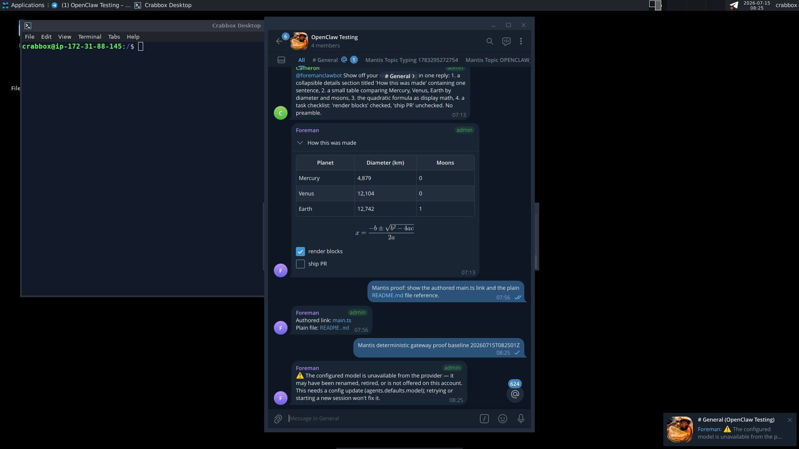
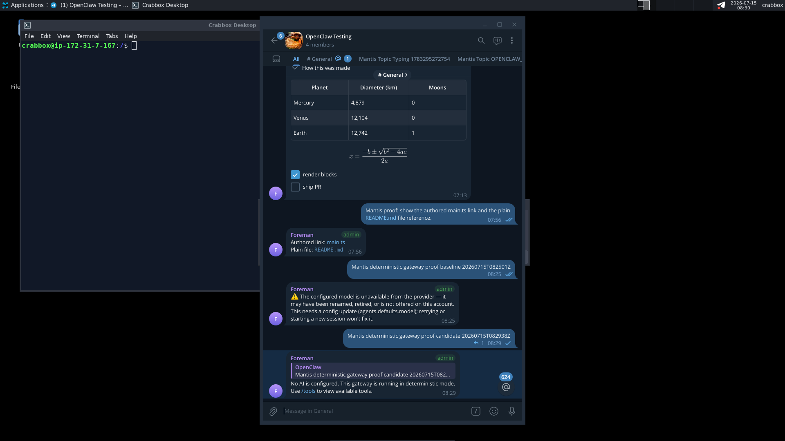

# OpenClaw Deterministic

[](#version-pin)
[](patches/openclaw-2026.7.1-deterministic.patch)
[](https://hub.docker.com/r/safrano9999/openclaw-ephemeral)

The independently maintained, exact deterministic gateway patch used by the
Safrano OpenClaw image.

This is a standalone public repository owned by `safrano9999`. It is not a
GitHub fork and has no pull-request relationship to another repository.

## Patch

The canonical patch is:

```text
patches/openclaw-2026.7.1-deterministic.patch
```

SHA-256:

```text
fbb06c0c21ed66be1d50042c1ba506ab8264f557fe8a7711756daa987cd0f711
```

It contains the functional 16-file deterministic change set without unrelated
repository history or automation.

## Deterministic routes

| Model | Behavior |
|---|---|
| `dummy/dummy` | Commands and plugins run first. An unclaimed message receives a fixed reply without a normal model turn. |
| `dummy/note` | Commands and plugins run first. NOTE can claim and persist the message without an LLM call. |

Normal providers, tools, plugins, and LLM-backed models remain available when
another model is selected.

## Historical visible proof

The preserved native Telegram Desktop recording shows the route concept before
and after enabling `dummy/dummy`: an unavailable normal model produces a
provider error, while the deterministic route handles the ordinary message
immediately. Commands and plugin hooks remain ahead of the fallback.

<table>
  <thead>
    <tr>
      <th width="50%">Before</th>
      <th width="50%">Deterministic route</th>
    </tr>
  </thead>
  <tbody>
    <tr>
      <td>
        <a href="docs/demo/deterministic-before.mp4">
          
        </a>
      </td>
      <td>
        <a href="docs/demo/deterministic-after.mp4">
          
        </a>
      </td>
    </tr>
  </tbody>
</table>

Click either screenshot to open its MP4 recording.

These recordings predate the `2026.7.1` port. They demonstrate routing behavior,
not byte-exact release wording; the canonical behavior is the version-pinned
patch in this repository.

### NOTE full mode

`dummy/note` lets the separate NOTE plugin claim ordinary non-command messages,
store them without a model request, acknowledge the save, and return them
through `/note show`.


The NOTE screenshot is a workflow illustration captured on OpenClaw `2026.6.11`,
not a `2026.7.1` build-verification artifact.

## Version pin

The patch applies only to OpenClaw `2026.7.1`.
The complete machine-readable build input is recorded in `build.conf`.
Its corresponding runtime image is `ghcr.io/openclaw/openclaw:2026.7.1`.

```bash
git apply patches/openclaw-2026.7.1-deterministic.patch
```

There is no automatic forward-port or compatibility layer. A newer OpenClaw
version requires an explicit new patch and release.

## Public package

The distribution is intentionally split into three public repositories:

| Repository | Responsibility |
|---|---|
| [openclaw-deterministic](https://github.com/safrano9999/openclaw-deterministic) | This exact version-pinned patch |
| [NOTE](https://github.com/safrano9999/NOTE) | Independent storage plugin for `dummy/note` |
| [openclaw-ephemeral](https://github.com/safrano9999/openclaw-ephemeral) | Python startup configuration and image build |

The ready-to-run public image is:

```text
docker.io/safrano9999/openclaw-ephemeral
```

## License

See [LICENSE](LICENSE).
